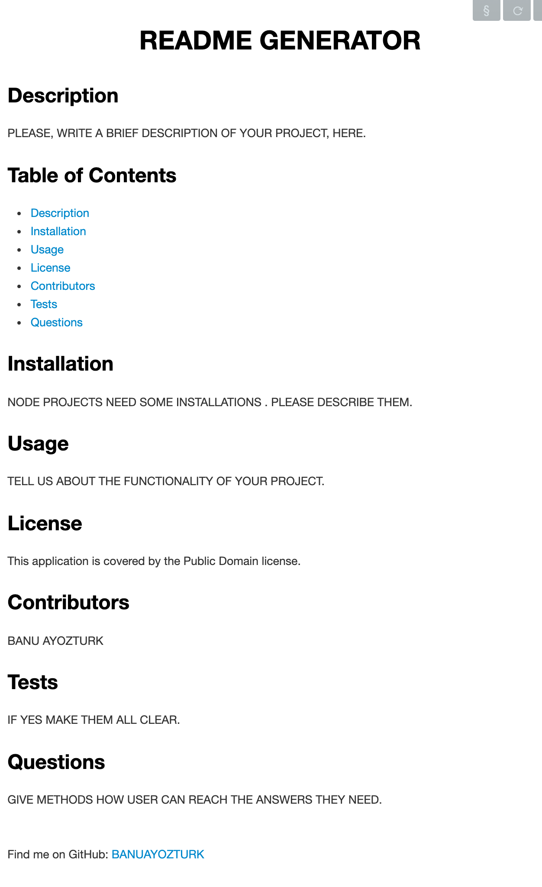

# readme-generator

## Description

I created a command-line application, that runs with node.js, to generate a README file with information about the project.

This application dynamically generates the README file,based on the input data. You can check out output.md file in this repo as an example.

## Screenshot

## Usage

When you run node index.js, the application uses the inquirer package to prompt you in the command line with a series of questions about your your project.

The application then takes your responses and uses util module to provide some functions to print formatted strings as well. And fs.writeFile is used to generate output.md file. 

## Credits and Libraries

 [Node.js-util module](https://www.w3resource.com/node.js/nodejs-utility.php)

 [Node.js-inquirer](https://www.npmjs.com/package/inquirer)

 [Asynchronous programming wit async and await](https://developer.mozilla.org/en-US/docs/Learn/JavaScript/Asynchronous/Async_await)

 [Try-catch blocks with async-await](https://stackoverflow.com/questions/40884153/try-catch-blocks-with-async-await)

 ## Contact Me
For any question about the project, please contact me.
[BanuAyozturk](mailto:bnyksl@gmail.com)

